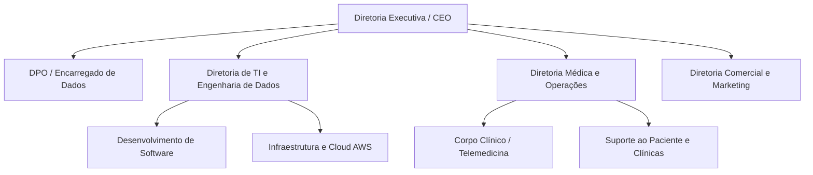

# 🏢 Projeto Integrador: Gestão de Dados e Estrutura Organizacional

> Trabalho acadêmico da disciplina de Gestão de Dados focado no planejamento estratégico de uma organização e na governança de seu ecossistema de software e dados.

---

## 👥 Equipe e Divisão de Responsabilidades

| Membro | Cargo na Empresa (Vitalis Saúde Digital) | Atribuição no Projeto GitHub |
| :--- | :--- | :--- |
| **Carlos Henrique Santiago** | CEO (Diretor Executivo) | Líder do Repositório & Identidade Institucional |
| **João Guilherme Pinheiro** | CMO / Diretor Comercial | Produtos, Serviços e Ecossistema de Parceiros |
| **Gustavo Bezerra Nonato** | COO (Diretor de Operações) | Organograma e Processos de Negócio |
| **Hudnei Sued Santana** | Arquiteto de Software | Escopo da Plataforma e Ciclo de Dados |
| **Joalisson Pinto Maia** | Engenheiro / DBA de Dados | Infraestrutura de Banco e Armazenamento em Nuvem |
| **Emerson Lucas Sacramento** | DPO (Encarregado LGPD / Segurança) | Proteção de Dados Sensíveis e Criptografia |
| **Mateus Queiroz** | Analista de Governança e Riscos | Análise de Riscos de Dados e Valor de Negócio |

# PARTE 1: MODELAGEM DA EMPRESA

<!-- ======================================================== -->
<!-- SEÇÃO DO INTEGRANTE 1                                    -->
<!-- ======================================================== -->
## 1.1 Identidade Institucional
*Responsável: Carlos Henrique De Souza Santana Santiago*

### 1.1.1 Nome da Empresa e Marca

* **Nome Fantasia:** Vitalis Saúde Digital.

* **Razão Social:** Vitalis Tecnologia em Saúde e Serviços S.A.

* **Justificativa da Marca:**  O nome Vitalis provém do latim vitalis, que significa "pertencente ou relativo à vida", "essencial" e "que sustenta a vida". A junção com Saúde Digital posiciona a organização diretamente no ecossistema de inovação tecnológica, refletindo a proposta de ser uma ponte ágil, segura e vital entre profissionais de saúde e pacientes.

### 1.1.2 Segmento de Atuação

* **Setor:** Tecnologia da Informação aplicada à Saúde (HealthTech).

* **Nicho**: Plataformas integradas de telemedicina, gestão de prontuário eletrônico em nuvem (PEP - Prontuário Eletrônico do Paciente) e emissão de prescrições digitais com assinatura com certificação ICP-Brasil.
  
* **Modelo de Negócio:**
  * B2B (Business to Business): Fornecimento da infraestrutura de software como serviço (SaaS) para clínicas, hospitais de pequeno/médio porte e operadoras de saúde suplementar.
  * B2C (Business to Consumer): Acesso direto de pacientes a consultas eletivas via aplicativo web e mobile.

### 1.1.3 Missão, Visão e Valores
* **Missão:** Democratizar o acesso à saúde de qualidade e humanizada por meio de soluções digitais integradas, conectando pacientes e profissionais de saúde com segurança, eficiência e máxima proteção de dados clínicos.
  
* **Visão:** Consolidar-se como o ecossistema digital de saúde mais confiável do país, unindo telemedicina de ponta e governança avançada de dados clínicos para transformar informações médicas em diagnósticos mais rápidos, precisos e seguros.
  
* **Valores:**
  * ***1 Vida e Saúde em Primeiro Lugar:*** A tecnologia é um meio para salvar vidas e melhorar o cuidado humano; nenhuma decisão técnica ou comercial se sobrepõe ao bem-estar do paciente.
  * ***2 Privacidade e Confidencialidade Inegociáveis:*** Rigor e transparência no tratamento de dados pessoais e clínicos sensíveis, mantendo conformidade contínua com a LGPD e padrões éticos médicos (CFM).
  * ***3 Inovação com Rigor Científico:*** Desenvolvimento de software baseado em evidências, segurança da informação e confiabilidade operacional crítica.
  * ***4 Acessibilidade e Usabilidade:*** Criar experiências digitais intuitivas para que médicos e pacientes — independentemente do nível de letramento digital — tenham uma experiência fluida e sem atritos.]
  * ***5 Integridade e Ética nos Dados:*** Garantia de que diagnósticos, prescrições e laudos sejam imutáveis, rastreáveis e acessíveis apenas por quem tem autorização legítima.

---

<!-- ======================================================== -->
<!-- SEÇÃO DO INTEGRANTE 2                                    -->
<!-- ======================================================== -->
## 1.2 Mercado, Oferta e Ecossistema

Responsável: João Guilherme Pinheiro

### 1.2.1 Produtos e Serviços

A Vitalis Saúde Digital oferece um ecossistema integrado de soluções digitais voltadas à modernização e digitalização dos serviços de saúde. Seu portfólio é dividido principalmente entre soluções destinadas a profissionais e instituições de saúde e serviços direcionados diretamente aos pacientes.

O principal produto é a plataforma de gestão de saúde em nuvem, disponibilizada no modelo SaaS, que permite a clínicas, consultórios, hospitais de pequeno e médio porte e operadoras de saúde gerenciar informações e processos relacionados ao atendimento dos pacientes.

Entre os principais serviços e funcionalidades oferecidos estão:

Telemedicina: realização de consultas médicas de forma remota, por meio de ambiente digital seguro, permitindo a comunicação entre pacientes e profissionais de saúde.
Prontuário Eletrônico do Paciente (PEP): armazenamento e gerenciamento centralizado do histórico clínico, consultas, exames, diagnósticos e demais informações relacionadas ao paciente.
Prescrição digital: emissão de receitas e prescrições eletrônicas com assinatura digital baseada em certificação ICP-Brasil, proporcionando maior autenticidade, rastreabilidade e segurança.
Gestão de pacientes: cadastro, acompanhamento e organização das informações dos pacientes em um único ambiente.
Agendamento de consultas: gerenciamento da agenda dos profissionais e disponibilização de horários para atendimento presencial ou remoto.
Gestão de profissionais de saúde: organização das informações, agendas e atendimentos dos profissionais vinculados à instituição.
Aplicativo ou plataforma para pacientes: ambiente destinado ao acesso a consultas, documentos médicos, prescrições e demais serviços disponibilizados pela instituição.
Armazenamento seguro em nuvem: infraestrutura para armazenamento das informações de saúde, com mecanismos de controle de acesso, autenticação e proteção dos dados.
Relatórios e indicadores: disponibilização de informações para apoiar a gestão das instituições de saúde e a tomada de decisões.

Dessa forma, a proposta de valor da Vitalis está na integração desses serviços em uma única plataforma, reduzindo a fragmentação dos sistemas utilizados pelas instituições de saúde e proporcionando maior eficiência operacional, acessibilidade e segurança no tratamento dos dados clínicos.

### 1.2.2 Clientes

O público da Vitalis Saúde Digital está dividido em dois principais segmentos: clientes institucionais (B2B) e usuários finais (B2C).

No modelo B2B, o público-alvo é composto principalmente por clínicas particulares, consultórios médicos, hospitais de pequeno e médio porte e operadoras de planos de saúde que necessitam digitalizar seus processos, centralizar informações clínicas e oferecer atendimento remoto aos seus pacientes.

Entre as principais personas desse segmento estão:

Gestor de clínica: responsável pela administração da instituição e interessado em reduzir custos operacionais, organizar processos, melhorar a produtividade da equipe e obter maior controle sobre os atendimentos.

Profissional de saúde: médico ou outro profissional habilitado que utiliza a plataforma para realizar consultas, consultar prontuários, registrar informações clínicas, emitir prescrições digitais e acompanhar seus pacientes.

Equipe administrativa: profissionais responsáveis por atividades como cadastro de pacientes, agendamento, organização da agenda e suporte aos atendimentos.

No modelo B2C, os principais usuários são os pacientes que utilizam a plataforma para acessar serviços de saúde, principalmente consultas eletivas por telemedicina. Esse público busca maior praticidade, redução da necessidade de deslocamento, facilidade de acesso a profissionais e disponibilidade de suas informações e documentos de saúde em ambiente digital.

De maneira geral, o cliente da Vitalis busca uma solução que combine praticidade, segurança, confiabilidade, facilidade de uso e integração dos serviços de saúde em uma única plataforma.

### 1.2.3 Fornecedores e Parceiros Estratégicos

Para disponibilizar seus serviços, a Vitalis Saúde Digital depende de fornecedores e parceiros estratégicos responsáveis principalmente pela infraestrutura tecnológica, segurança, conectividade e serviços relacionados ao ecossistema de saúde digital.

Entre os principais fornecedores críticos estão os provedores de computação e armazenamento em nuvem, responsáveis pela hospedagem da plataforma, dos bancos de dados e dos prontuários eletrônicos. Esses fornecedores são fundamentais para garantir disponibilidade, escalabilidade, redundância e segurança da infraestrutura.

Também são necessários provedores de serviços de telecomunicações e internet, que possibilitam a comunicação entre pacientes e profissionais durante as consultas de telemedicina.

Outro grupo importante é formado por provedores de serviços de segurança da informação, incluindo soluções de criptografia, autenticação, monitoramento, controle de acesso, backup e proteção contra ataques cibernéticos. Esses fornecedores possuem importância estratégica devido à natureza sensível dos dados tratados pela empresa.

No âmbito das prescrições digitais, a Vitalis também depende de autoridades e provedores de certificação digital vinculados à ICP-Brasil, responsáveis por fornecer mecanismos de certificação e assinatura digital necessários para garantir autenticidade e integridade dos documentos eletrônicos.

Entre os parceiros estratégicos, destacam-se clínicas, hospitais, profissionais de saúde, operadoras de saúde e instituições relacionadas ao setor, que podem utilizar, integrar ou divulgar as soluções da plataforma.

Além disso, podem ser estabelecidas parcerias com empresas de tecnologia, laboratórios, plataformas de exames e outros sistemas de saúde, permitindo futuramente a integração de informações e serviços e ampliando o ecossistema digital da Vitalis.

Assim, o ecossistema da empresa é formado pela integração entre Vitalis, profissionais de saúde, instituições, pacientes, fornecedores de infraestrutura tecnológica e parceiros do setor de saúde, criando uma cadeia de serviços digitais na qual a segurança, disponibilidade e interoperabilidade dos dados são fatores críticos para o funcionamento do negócio.

---

<!-- ======================================================== -->
<!-- SEÇÃO DO INTEGRANTE 3                                    -->
<!-- ======================================================== -->
## 1.3 Estrutura Organizacional e Estratégia
*Responsável: Gustavo Bezerra Nonato*

### 1.3.1 Organograma

A estrutura hierárquica da Vitalis Saúde Digital foi desenhada para sustentar uma operação de HealthTech no modelo SaaS. Conforme as exigências estratégicas do negócio, a estrutura conta obrigatoriamente com uma Diretoria de TI/Engenharia de Dados e um DPO (Encarregado de Dados) para garantir a governança e a segurança técnica.

---

# PARTE 2: PROJETO DE SOFTWARE E GESTÃO DE DADOS

<!-- ======================================================== -->
<!-- SEÇÃO DO INTEGRANTE 4                                    -->
<!-- ======================================================== -->
## 2.1 Visão Geral do Software e Ciclo de Dados
*Responsável: Hudnei Sued Santana*

### 2.1.1 Descrição do Sistema / Produto de Software
* O VitalisConnect é a plataforma digital de saúde da Vitalis Saúde Digital, responsável por conectar pacientes e profissionais de saúde por meio de teleconsultas, gerenciamento do Prontuário Eletrônico do Paciente (PEP) e emissão de prescrições médicas digitais assinadas com certificado digital.

### 2.1.2 Dados Produzidos e Utilizados

O sistema produz e utiliza diferentes categorias de dados durante o ciclo de atendimento do paciente.

### Dados cadastrais
- Dados de identificação do paciente;
- Informações necessárias para cadastro e identificação.

### Dados clínicos
- Sintomas;
- Anotações de prontuário;
- Histórico clínico;
- Diagnósticos;
- CID-10;
- Informações sobre medicamentos.

### Documentos
- Exames;
- Laudos;
- Prescrições digitais.

### Dados de operação
- Logs de login;
- Registros relacionados ao acesso e utilização do sistema.

### 2.1.3 Ciclo dos Dados

O ciclo de dados do VitalisConnect acompanha o fluxo de atendimento do paciente:

Cadastro → Teleconsulta → Registro no Prontuário → Emissão de Prescrição → Consulta do Histórico e Documentos.

Durante esse fluxo, os dados são produzidos ou atualizados pelos usuários autorizados e posteriormente utilizados para continuidade do atendimento e acesso às informações clínicas.

### 2.1.4 Usuários dos Dados

### Médico/Profissional de Saúde
- Consulta dados do paciente;
- Registra informações no prontuário;
- Consulta histórico clínico;
- Registra diagnósticos;
- Emite prescrições digitais.

### Paciente
- Fornece seus dados cadastrais e informações durante o atendimento;
- Consulta seu histórico;
- Acessa prescrições e documentos relacionados ao atendimento.

### Recepção/Faturamento
- Consulta dados necessários para processos administrativos;
- Utiliza informações relacionadas a pagamento e convênio.

### 2.1.5 Entradas e Saídas

As principais entradas do sistema são os dados cadastrais do paciente, sintomas e informações fornecidas durante a consulta, além dos registros realizados pelos profissionais de saúde.

Como saídas, o sistema disponibiliza o prontuário eletrônico, informações do histórico clínico, documentos relacionados ao atendimento e prescrições médicas digitais.

---

<!-- ======================================================== -->
<!-- SEÇÃO DO INTEGRANTE 5                                    -->
<!-- ======================================================== -->

## 2.2 Arquitetura de Armazenamento
*Responsável: Joalisson Pinto Maia*

### 2.2.1 Onde os Dados são Armazenados
Como a Vitalis trabalha com diferentes tipos de dados, cada informação será armazenada na tecnologia mais adequada para sua necessidade.

- **PostgreSQL:** usado para dados estruturados, como prontuários, consultas, prescrições, usuários, agendamentos e transações.
- **MongoDB / DynamoDB:** usado para logs, auditoria, sessões de telemedicina e dados gerados por dispositivos *wearables*.
- **Cloudflare R2 / AWS S3:** usado para arquivos maiores e não estruturados, como exames, laudos, PDFs, imagens médicas e gravações de teleconsultas.
- **Redis:** usado para informações temporárias que precisam de acesso rápido, como sessões, tokens e horários disponíveis.
Dessa forma, evitamos concentrar todos os tipos de dados em apenas uma tecnologia.

---

### 2.2.2 Infraestrutura de Nuvem
A infraestrutura principal da Vitalis será baseada na **AWS**, utilizando a região de São Paulo (**sa-east-1**), com serviços complementares podendo utilizar outras plataformas, como o **Cloudflare R2** para armazenamento de arquivos.

O PostgreSQL será utilizado por meio do **Amazon RDS**, com configuração **Multi-AZ**, permitindo que outra instância assuma o serviço caso aconteça alguma falha.

Também poderão ser utilizados **Auto Scaling** e **Application Load Balancer (ALB)** para distribuir os acessos e ajustar os recursos conforme o número de usuários da plataforma.

---

### 2.2.3 Backup, Retenção e Ciclo de Vida dos Dados
Por trabalhar com dados médicos e informações pessoais, a Vitalis precisa garantir que esses dados estejam protegidos, disponíveis e possam ser recuperados em caso de falha.
Para isso, serão considerados os requisitos da **LGPD** e da **Lei nº 13.787/2018**.

#### 2.2.4 Rotinas de Backup
O PostgreSQL no RDS contará com mecanismos de backup e recuperação, como:
- **Point-in-Time Recovery (PITR):** permite recuperar o banco para um momento anterior dentro do período configurado.
- **Backups periódicos:** cópias dos dados para reduzir o risco de perda das informações.

Como objetivo de recuperação, a arquitetura considera:
- **RPO:** inferior a 5 minutos.
- **RTO:** inferior a 1 hora.

---

#### 2.2.5 Retenção dos Dados
Os prontuários e dados clínicos serão mantidos pelo prazo mínimo de **20 anos**, considerando a Lei nº 13.787/2018.
Os logs de acesso e auditoria também serão mantidos pelo período necessário para garantir rastreabilidade e atender às exigências legais.

---

#### 2.2.6 Ciclo de Vida do Armazenamento
Arquivos como exames, imagens e documentos médicos podem ocupar bastante espaço com o passar do tempo.
Por isso, os arquivos armazenados no **Cloudflare R2** ou **Amazon S3** poderão utilizar políticas de ciclo de vida, permitindo organizar e gerenciar arquivos mais antigos de forma automática.

Assim, a Vitalis consegue manter os dados pelo período necessário, buscando reduzir os custos de armazenamento sem comprometer a disponibilidade das informações.
---

<!-- ======================================================== -->
<!-- SEÇÃO DO INTEGRANTE 6                                     -->
<!-- ======================================================== -->
## 2.3 Privacidade e Proteção de Dados Sensíveis
*Responsável: Emerson Lucas Sacramento Lima*

### 2.3.1 Mapeamento de Dados Sensíveis
Como os serviços da Vitalis Saúde Digital envolvem consultas e prontuários médicos, o uso de dados pessoais e de saúde faz parte do funcionamento básico da plataforma. A adequação à Lei Geral de Proteção de Dados (LGPD - Lei nº 13.709/2018) busca garantir a segurança das informações e a privacidade dos pacientes e médicos.

O inventário de dados da organização está estruturado conforme a classificação a seguir:

| Categoria do Dado | Dados Coletados | Finalidade do Tratamento | Base Legal (LGPD) |
| :--- | :--- | :--- | :--- |
| **Dados de Saúde (Sensíveis)** | Histórico clínico, sintomas, diagnósticos, exames e prescrições médicas. | Prestação do serviço de telemedicina e gestão do Prontuário Eletrônico do Paciente (PEP). | Tutela da Saúde (Art. 11, II, "f") |
| **Dados Biométricos** | Validação facial do paciente e assinatura digital do médico. | Autenticação de identidade, prevenção a fraudes e validação de documentos médicos. | Prevenção à Fraude (Art. 11, II, "g") |
| **Dados Pessoais Gerais** | Nome, CPF, e-mail, telefone e registro profissional (CRM). | Cadastro, autenticação na plataforma, comunicação e emissão de notas fiscais. | Execução de Contrato (Art. 7º, V) |
| **Dados Financeiros** | Informações de cartão de crédito e histórico de transações. | Processamento de pagamentos de consultas e assinaturas do modelo SaaS. | Execução de Contrato (Art. 7º, V) |

#### Prazos de Retenção e Guarda de Dados
* **Prontuários Médicos:** Armazenamento obrigatório pelo período mínimo de **20 (vinte) anos**, em conformidade com a Lei nº 13.787/2018 e resoluções do Conselho Federal de Medicina (CFM).
* **Logs de Acesso:** Manutenção dos registros de conexão e acesso a aplicações pelo prazo mínimo de **6 (seis) meses**, atendendo ao Marco Civil da Internet (Lei nº 12.965/2014).

---

### 2.3.2 Mecanismos de Segurança e Privacidade

A proteção de dados e a garantia de privacidade na plataforma Vitalis são estruturadas por meio das seguintes diretrizes e controles técnicos:

#### 1. Criptografia de Dados
* **Dados em Trânsito:** Todo o tráfego de dados entre os clientes e os servidores ocorre via protocolo seguro HTTPS/TLS. Transmissões de áudio e vídeo durante teleconsultas utilizam canal cifrado de ponta a ponta.
* **Dados em Repouso:** Os arquivos de exames, laudos e bancos de dados utilizam algoritmo de criptografia **AES-256**, impedindo a leitura indevida dos dados no nível de armazenamento.

#### 2. Controle de Acesso (RBAC)
* **Profissionais de Saúde:** Acesso restrito aos prontuários e históricos médicos dos pacientes vinculados ao seu atendimento atual ou prévio.
* **Pacientes:** Visualização exclusiva dos próprios dados cadastrais, históricos de consultas, receitas e exames.
* **Equipe de Infraestrutura e Suporte:** Acesso limitado a logs operacionais e métricas de desempenho, sem permissão de visualização do conteúdo clínico.
* **Autenticação:** Exigência de Autenticação Multi-fator (MFA/2FA) para acesso de médicos e perfis administrativos.

#### 3. Pseudonimização e Anonimização
* **Relatórios e Métricas de Negócio:** Para fins de inteligência de mercado e geração de indicadores operacionais, os identificadores diretos (como nome e CPF) são substituídos por hashes irreversíveis ou totalmente removidos dos conjuntos de dados.

#### 4. Gestão de Direitos dos Titulares
A plataforma disponibiliza interface para atendimento às requisições dos titulares previstas no Art. 18 da LGPD, contemplando:
* Confirmação e acesso aos dados pessoais armazenados.
* Solicitação de correção de dados incompletos ou desatualizados.
* Exportação do histórico clínico em formato estruturado e interoperável (portabilidade).

---

<!-- ======================================================== -->
<!-- SEÇÃO DO INTEGRANTE 7                                    -->
<!-- ======================================================== -->
## 2.4 Governança, Riscos e Valor de Negócio

**Responsável: Mateus Queiroz**

### 2.4.1 Problemas Relacionados aos Dados

Por atuar diretamente com informações clínicas, cadastrais e administrativas, a Vitalis Saúde Digital depende de dados completos, precisos, atualizados e disponíveis para garantir a qualidade de seus serviços. Nesse contexto, alguns problemas relacionados à qualidade dos dados podem impactar tanto os processos operacionais quanto a tomada de decisões da organização.

Um dos principais desafios é a duplicidade de dados, que pode ocorrer quando um mesmo paciente, profissional ou atendimento é cadastrado mais de uma vez na plataforma. Essa situação pode fragmentar o histórico clínico do paciente, gerar inconsistências nos prontuários e dificultar a obtenção de uma visão única e confiável das informações.

Outro problema relevante é a inconsistência dos dados, que pode surgir quando informações iguais são registradas de maneiras diferentes ou apresentam divergências entre os sistemas. Um exemplo seria a existência de informações cadastrais diferentes para o mesmo paciente ou divergências entre dados do agendamento, prontuário e atendimento realizado. Esse tipo de problema compromete a confiabilidade das informações e pode gerar erros nos processos.

A latência dos dados também representa um desafio, principalmente em operações que dependem de informações atualizadas em tempo real. Em um cenário de telemedicina, por exemplo, atrasos na sincronização de informações entre diferentes componentes da plataforma podem comprometer o atendimento, o acesso ao prontuário ou a atualização de registros clínicos.

Também devem ser considerados os erros de preenchimento, decorrentes de informações incompletas, incorretas ou inseridas em formatos inadequados pelos usuários. Esses erros podem afetar o cadastro de pacientes, registros médicos, resultados de exames, prescrições e informações utilizadas em relatórios gerenciais.

Diante desses desafios, a Vitalis necessita de mecanismos de governança e qualidade de dados, como padronização de campos, validação automática, identificação e tratamento de duplicidades, regras de integridade, monitoramento da qualidade e definição clara de responsabilidades sobre os dados. Essas práticas contribuem para garantir que as informações utilizadas pela plataforma sejam confiáveis, consistentes e adequadas às necessidades do negócio.

### 2.4.2 Riscos Identificados

O tratamento de dados de saúde e a dependência de sistemas digitais fazem com que a Vitalis esteja exposta a diferentes riscos que podem afetar suas operações, seus clientes e sua reputação.

Entre os principais estão os riscos operacionais, relacionados a falhas nos sistemas, erros de processamento, inconsistências nos dados ou utilização de informações incorretas. Esses problemas podem provocar retrabalho, atrasos no atendimento, erros administrativos e dificuldades na execução das atividades realizadas por profissionais de saúde e equipes das instituições clientes.

Outro risco importante é o de indisponibilidade dos sistemas e dados. Como a plataforma depende de infraestrutura em nuvem para disponibilizar prontuários, agendamentos, prescrições e consultas por telemedicina, uma interrupção prolongada pode comprometer diretamente a continuidade dos serviços. A indisponibilidade também pode provocar impactos financeiros, insatisfação dos clientes e perda de confiança na plataforma.

O vazamento ou acesso indevido a dados representa um dos riscos mais críticos para a organização. As informações tratadas pela Vitalis incluem dados pessoais e informações relacionadas à saúde dos pacientes, exigindo controles rigorosos de segurança. A ocorrência de incidentes pode resultar em exposição de informações confidenciais, danos aos titulares dos dados, prejuízos financeiros e impactos significativos sobre a reputação da empresa.

Também existem riscos regulatórios, relacionados ao descumprimento de requisitos legais e normativos aplicáveis ao tratamento de dados e à prestação de serviços digitais de saúde. A organização precisa manter mecanismos de conformidade, segurança, controle de acesso, rastreabilidade e proteção das informações, reduzindo a possibilidade de sanções e outros impactos decorrentes de não conformidades.

Para reduzir esses riscos, a Vitalis deve adotar uma abordagem de governança baseada em gestão de acessos, criptografia, backups, monitoramento, auditoria, rastreabilidade, políticas de segurança, planos de continuidade e recuperação de desastres, além de processos periódicos de avaliação e tratamento de riscos.

### 2.4.3 Necessidades do Negócio

As necessidades de negócio da Vitalis estão diretamente relacionadas à capacidade de transformar dados em informações confiáveis para sustentar suas operações e apoiar decisões estratégicas. Nesse contexto, o gerenciamento e a arquitetura de dados devem garantir que as informações estejam disponíveis de forma segura, integrada, consistente e no momento adequado.

No âmbito operacional, a organização necessita de uma estrutura que permita centralizar e integrar informações de pacientes, profissionais, consultas, prontuários, prescrições e agendamentos, reduzindo a fragmentação dos dados e facilitando o trabalho das equipes. Essa integração contribui para diminuir retrabalho, evitar erros e proporcionar maior eficiência aos processos.

A arquitetura de dados também deve garantir disponibilidade e desempenho, principalmente porque serviços como telemedicina e acesso ao prontuário eletrônico dependem da consulta rápida às informações. Dessa forma, é necessário utilizar uma infraestrutura capaz de suportar o crescimento do volume de dados e da quantidade de usuários sem comprometer a qualidade dos serviços.

Outra necessidade estratégica é a segurança e governança dos dados. A organização precisa estabelecer políticas, responsabilidades e controles que determinem quem pode acessar, alterar ou consultar cada tipo de informação. A rastreabilidade das operações também é importante para identificar acessos, alterações e movimentações realizadas nos dados.

Além disso, os dados devem fornecer suporte à tomada de decisões gerenciais, possibilitando a criação de indicadores relacionados a atendimentos, utilização da plataforma, desempenho dos profissionais, perfil de pacientes e eficiência dos processos. Com informações confiáveis, a gestão pode identificar oportunidades de melhoria, antecipar problemas e direcionar investimentos de maneira mais eficiente.

Portanto, o gerenciamento e a arquitetura de dados representam elementos estratégicos para a Vitalis Saúde Digital. Ao garantir qualidade, integração, segurança, disponibilidade e governança das informações, a organização consegue reduzir riscos, melhorar seus processos, aumentar a confiabilidade dos serviços e gerar valor para pacientes, profissionais de saúde e instituições clientes.

---
